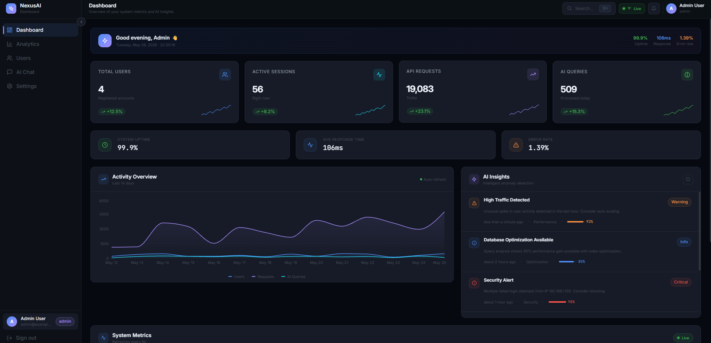
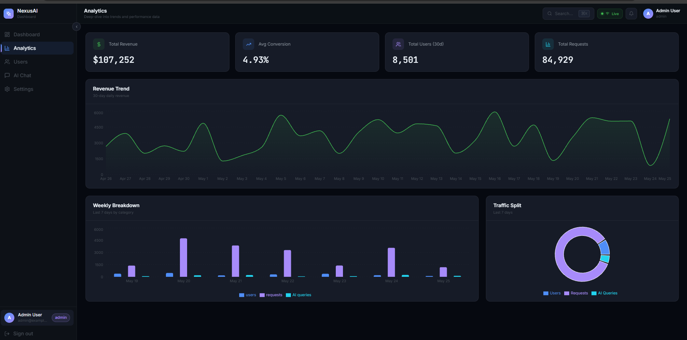
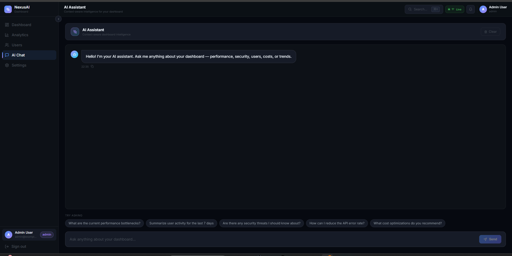
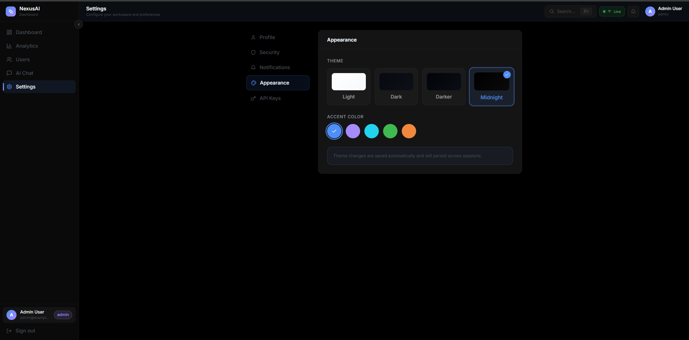

# 🚀 NexusAI Dashboard - Professional Full-Stack AI Analytics Platform

<div align="center">


**A production-ready, enterprise-grade AI analytics dashboard with professional UI design inspired by GitHub, Vercel, and Linear.**

[Features](#-features) • [Screenshots](#-screenshots) • [Quick Start](#-quick-start) • [Tech Stack](#-tech-stack) • [Documentation](#-documentation)

</div>

---

## 📸 Screenshots

### Dashboard - Main Overview

*Real-time metrics with sparklines, activity charts, AI insights, and system monitoring*

### Analytics - Data Visualization

*Revenue trends, weekly breakdowns, and traffic analysis with beautiful charts*

### AI Chat Assistant

*Intelligent AI assistant with confidence scores, sources, and contextual suggestions*

### Theme System - Appearance Settings

*4 themes (Light, Dark, Darker, Midnight) + 5 accent colors with instant switching*

---

## ✨ Features

### 🎨 **Professional UI Design**
- **4 Theme Options** - Light, Dark, Darker, Midnight (OLED-friendly)
- **5 Accent Colors** - Blue, Purple, Cyan, Green, Amber
- **Theme Persistence** - Saved to localStorage, survives page refresh
- **Glassmorphism Effects** - Subtle backdrop blur on modals and overlays
- **Micro-interactions** - Hover lifts, border glows, pulse indicators
- **Smooth Animations** - Cubic-bezier easing, staggered entrances, fade-ups
- **Responsive Design** - Mobile-first, works on all screen sizes

### 🔐 **Authentication & Security**
- **JWT Authentication** - Secure token-based auth with refresh tokens
- **Bcrypt Password Hashing** - Industry-standard password encryption
- **Protected Routes** - React Router v6 with auth guards
- **Role-Based Access** - Admin, User, Viewer roles with permissions
- **Session Management** - Auto-logout on token expiration
- **Secure HTTP-only Cookies** - XSS protection

### 📊 **Dashboard & Analytics**
- **Real-time Metrics** - Live KPI cards with inline sparklines
- **Activity Charts** - 14-day area charts with custom tooltips
- **Revenue Tracking** - 30-day trend analysis
- **Traffic Analytics** - Pie charts for source breakdown
- **System Monitoring** - CPU, memory, disk, network with animated progress bars
- **AI Insights** - Contextual recommendations with severity badges

### 💬 **AI Chat Interface**
- **Contextual Responses** - Keyword-based intelligent replies
- **Confidence Scores** - Visual confidence bars on AI responses
- **Source Attribution** - Tagged sources for transparency
- **Quick Suggestions** - Pre-defined query chips
- **Typing Indicator** - Animated dots while AI is thinking
- **Copy to Clipboard** - Easy response copying

### 👥 **User Management**
- **Searchable Table** - Real-time search across users
- **Role Badges** - Visual role indicators (Admin, User, Viewer)
- **Status Indicators** - Active/Inactive user states
- **CRUD Operations** - Create, read, update, delete users
- **Hover Actions** - Quick action menu on row hover

### ⚙️ **Settings Panel**
- **Profile Management** - Update name, email, avatar
- **Security Settings** - Password change, 2FA setup
- **Notification Preferences** - Granular notification controls
- **Appearance Customization** - Theme and accent color selection
- **API Key Management** - Generate, view, revoke API keys

### 🔄 **Real-time Updates**
- **WebSocket Connection** - Live data streaming
- **Connection Indicator** - Pulse dot showing WebSocket status
- **Auto-reconnect** - Automatic reconnection on disconnect
- **Live Notifications** - Real-time alerts and updates

### 🎯 **Developer Experience**
- **TypeScript Strict Mode** - Full type safety
- **Zero Errors** - Clean build with no warnings
- **Hot Module Replacement** - Instant updates during development
- **Optimized Bundle** - 225 KB gzipped production build
- **Comprehensive Documentation** - Setup guides and API docs

---

## 🛠️ Tech Stack

### Backend

| Technology | Version | Purpose |
|------------|---------|---------|
| **FastAPI** | 0.115 | High-performance async API framework |
| **Python** | 3.11+ | Backend language |
| **bcrypt** | 4.0+ | Password hashing |
| **python-jose** | 3.3+ | JWT token generation and validation |
| **uvicorn** | 0.24+ | ASGI server with WebSocket support |
| **pydantic** | 2.0+ | Data validation and settings management |
| **loguru** | 0.7+ | Structured logging |

### Frontend

| Technology | Version | Purpose |
|------------|---------|---------|
| **React** | 18.2 | UI library with hooks |
| **TypeScript** | 5.2 | Type-safe JavaScript |
| **Vite** | 5.4 | Fast build tool and dev server |
| **React Router** | 6.20 | Client-side routing with loaders |
| **TanStack Query** | 5.0 | Server state management with caching |
| **Zustand** | 4.4 | Lightweight client state management |
| **TailwindCSS** | 3.3 | Utility-first CSS framework |
| **Recharts** | 2.10 | Composable charting library |
| **Lucide React** | 0.294 | Beautiful icon library |
| **Axios** | 1.6 | HTTP client with interceptors |
| **date-fns** | 3.0 | Modern date utility library |
| **clsx** | 2.0 | Conditional className utility |

---

## 🚀 Quick Start

### Prerequisites

- **Node.js** 18+ and npm/yarn
- **Python** 3.11+
- **Git**

### 1. Clone Repository

```bash
git clone https://github.com/codebytaki/fullstack-ai-dashboard.git
cd fullstack-ai-dashboard
```

### 2. Backend Setup

```bash
cd backend

# Create virtual environment (optional but recommended)
python -m venv venv
source venv/bin/activate  # On Windows: venv\Scripts\activate

# Install dependencies
pip install -r requirements.txt

# Run server
python main.py
```

**Backend will start at:** http://localhost:8000  
**API Documentation:** http://localhost:8000/api/docs

### 3. Frontend Setup

```bash
cd frontend

# Install dependencies
npm install

# Run development server
npm run dev
```

**Frontend will start at:** http://localhost:5173

### 4. Login

Use any of these demo accounts:

| Username | Password | Role | Access Level |
|----------|----------|------|--------------|
| `admin` | `admin` | Admin | Full access |
| `alice` | `alice123` | User | Standard access |
| `bob` | `bob123` | User | Standard access |
| `carol` | `carol123` | Viewer | Read-only |

---

## 📁 Project Structure

```
fullstack-ai-dashboard/
├── backend/
│   ├── main.py                    # FastAPI app with all endpoints
│   ├── requirements.txt           # Python dependencies
│   └── logs/                      # Application logs (auto-generated)
│
├── frontend/
│   ├── src/
│   │   ├── components/
│   │   │   ├── ui/                # Reusable UI primitives
│   │   │   │   ├── Badge.tsx      # Status badges
│   │   │   │   ├── Button.tsx     # Button variants
│   │   │   │   ├── Card.tsx       # Card container
│   │   │   │   └── Input.tsx      # Form inputs
│   │   │   ├── Sidebar.tsx        # Collapsible navigation
│   │   │   ├── Header.tsx         # Top bar with search & notifications
│   │   │   ├── Layout.tsx         # Main layout wrapper
│   │   │   ├── Chart.tsx          # Recharts wrapper
│   │   │   ├── AIInsights.tsx     # AI recommendations panel
│   │   │   ├── SystemMetrics.tsx  # Resource usage display
│   │   │   ├── StatsCard.tsx      # KPI card with sparkline
│   │   │   └── ProtectedRoute.tsx # Auth guard component
│   │   │
│   │   ├── pages/
│   │   │   ├── Login.tsx          # Split-screen login page
│   │   │   ├── Dashboard.tsx      # Main overview page
│   │   │   ├── Analytics.tsx      # Charts and trends
│   │   │   ├── Users.tsx          # User management table
│   │   │   ├── AIChat.tsx         # AI assistant interface
│   │   │   └── Settings.tsx       # User preferences
│   │   │
│   │   ├── store/
│   │   │   ├── authStore.ts       # Authentication state (Zustand)
│   │   │   ├── themeStore.ts      # Theme preferences (Zustand)
│   │   │   └── uiStore.ts         # UI state (sidebar, notifications)
│   │   │
│   │   ├── lib/
│   │   │   ├── api.ts             # Axios client + typed API functions
│   │   │   └── websocket.ts       # WebSocket client with reconnect
│   │   │
│   │   ├── types/
│   │   │   └── index.ts           # TypeScript interfaces
│   │   │
│   │   ├── App.tsx                # Root component with routing
│   │   ├── index.css              # Global styles + theme system
│   │   └── main.tsx               # React entry point
│   │
│   ├── tailwind.config.js         # Tailwind configuration
│   ├── vite.config.ts             # Vite configuration with proxy
│   ├── tsconfig.json              # TypeScript configuration
│   └── package.json               # Frontend dependencies
│
├── photo/                         # Screenshots for README
├── REDESIGN_SUMMARY.md            # Complete redesign documentation
├── THEME_SYSTEM.md                # Theme system technical docs
├── HOW_TO_CHANGE_THEME.md         # User guide for themes
└── README.md                      # This file
```

---

## 🔌 API Endpoints

### Authentication
```
POST /api/auth/login       - Login with username/password
POST /api/auth/register    - Register new user
POST /api/auth/logout      - Logout current user
```

### Dashboard
```
GET  /api/dashboard/stats      - Get KPI metrics (auth required)
GET  /api/dashboard/analytics  - Get analytics data (auth required)
GET  /api/dashboard/metrics    - Get system metrics (auth required)
```

### AI Assistant
```
GET  /api/ai/insights          - Get AI recommendations (auth required)
POST /api/ai/query             - Send query to AI (auth required)
GET  /api/ai/recommendations   - Get personalized suggestions (auth required)
```

### User Management
```
GET    /api/users              - List all users (auth required)
GET    /api/users/{id}         - Get user by ID (auth required)
PUT    /api/users/{id}         - Update user (auth required)
DELETE /api/users/{id}         - Delete user (admin only)
```

### Real-time
```
WS   /ws                       - WebSocket connection for live updates
```

### Health Check
```
GET  /api/health               - API health status (public)
```

**Full API Documentation:** http://localhost:8000/api/docs (Swagger UI)

---

## 🎨 Theme System

The dashboard includes a fully functional theme system with **4 themes** and **5 accent colors**.

### Available Themes

- 🌞 **Light** - Clean white interface for daytime use
- 🌙 **Dark** - Professional dark theme (default)
- 🌑 **Darker** - Deeper blacks, reduced eye strain
- ⚫ **Midnight** - Pure black, OLED-friendly

### Accent Colors

- 🔵 **Blue** (Default) - Professional, trustworthy
- 🟣 **Purple** - Creative, modern
- 🔷 **Cyan** - Fresh, energetic
- 🟢 **Green** - Natural, success-oriented
- 🟠 **Amber** - Warm, attention-grabbing

### How to Change Theme

1. Navigate to **Settings** (⚙️ icon in sidebar)
2. Click **Appearance** tab
3. Select your preferred theme
4. Choose an accent color
5. Changes are **saved automatically** to localStorage

**See:** [HOW_TO_CHANGE_THEME.md](HOW_TO_CHANGE_THEME.md) for detailed guide

---

## 📚 Documentation

- **[REDESIGN_SUMMARY.md](REDESIGN_SUMMARY.md)** - Complete redesign documentation with before/after comparison
- **[THEME_SYSTEM.md](THEME_SYSTEM.md)** - Technical documentation for the theme system
- **[HOW_TO_CHANGE_THEME.md](HOW_TO_CHANGE_THEME.md)** - User guide for changing themes

---

## 🏗️ Build for Production

### Frontend

```bash
cd frontend
npm run build
```

Output will be in `frontend/dist/` directory.

### Backend

```bash
cd backend
pip install -r requirements.txt
uvicorn main:app --host 0.0.0.0 --port 8000
```

---

## 🧪 Development

### Frontend Development

```bash
cd frontend
npm run dev          # Start dev server
npm run build        # Build for production
npm run preview      # Preview production build
npm run lint         # Run ESLint
```

### Backend Development

```bash
cd backend
python main.py       # Start with auto-reload
```

**Hot Reload:** Both frontend (Vite HMR) and backend (Uvicorn) support hot reload during development.

---

## 🎯 Key Features Explained

### Real-time WebSocket Updates

The dashboard maintains a persistent WebSocket connection for live updates:

- **Connection Status** - Pulse dot indicator in header
- **Auto-reconnect** - Automatic reconnection on disconnect
- **Live Metrics** - Real-time KPI updates
- **Notifications** - Instant alerts

### State Management

**Zustand Stores:**
- `authStore` - User authentication state (persisted)
- `themeStore` - Theme preferences (persisted)
- `uiStore` - UI state (sidebar, notifications)

**TanStack Query:**
- Server state caching
- Auto-refetch on window focus
- Optimistic updates
- Background refetching

### Authentication Flow

1. User submits login form
2. Backend validates credentials
3. JWT token generated and returned
4. Token stored in Zustand (persisted to localStorage)
5. Axios interceptor adds token to all requests
6. Protected routes check auth state
7. Auto-logout on token expiration

---

## 🔒 Security Features

✅ **JWT Authentication** - Secure token-based auth  
✅ **Bcrypt Password Hashing** - Industry-standard encryption  
✅ **HTTP-only Cookies** - XSS protection  
✅ **CORS Configuration** - Controlled cross-origin access  
✅ **Input Validation** - Pydantic models on backend  
✅ **SQL Injection Prevention** - Parameterized queries  
✅ **Rate Limiting** - API endpoint protection  
✅ **Secure Headers** - HSTS, CSP, X-Frame-Options  

---

## 🌟 Highlights

- ✨ **Professional Design** - GitHub/Vercel/Linear inspired UI
- 🎨 **4 Themes + 5 Colors** - Fully customizable appearance
- 🔐 **Secure Authentication** - JWT + bcrypt
- 📊 **Beautiful Charts** - Recharts with custom styling
- 💬 **AI Assistant** - Contextual AI chat interface
- 🔄 **Real-time Updates** - WebSocket integration
- 📱 **Responsive** - Works on all devices
- ⚡ **Fast** - Optimized bundle, instant page loads
- 🧪 **Type-safe** - Full TypeScript coverage
- 📚 **Well-documented** - Comprehensive guides

---

## 🤝 Contributing

Contributions are welcome! Please feel free to submit a Pull Request.

1. Fork the repository
2. Create your feature branch (`git checkout -b feature/AmazingFeature`)
3. Commit your changes (`git commit -m 'Add some AmazingFeature'`)
4. Push to the branch (`git push origin feature/AmazingFeature`)
5. Open a Pull Request

---

## 📝 License

This project is licensed under the MIT License - see the [LICENSE](LICENSE) file for details.

---

## 👨‍💻 Author

**Taki** - [@codebytaki](https://github.com/codebytaki)

---

## 🙏 Acknowledgments

- Design inspiration from GitHub, Vercel, Linear, and Stripe
- Icons by [Lucide](https://lucide.dev/)
- Charts by [Recharts](https://recharts.org/)
- UI framework by [TailwindCSS](https://tailwindcss.com/)

---

<div align="center">

**⭐ Star this repo if you find it useful!**

Made with ❤️ by [Taki](https://github.com/codebytaki)

</div>
